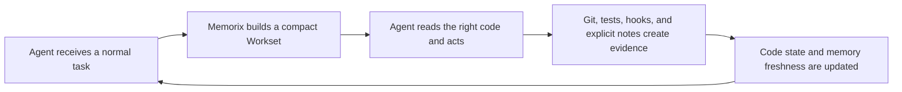

# Memorix 1.2 Product Story

Status: active product narrative
Companion: [1.2 Development Charter](1.2.0-DEVELOPMENT-CHARTER.md)
Start: 2026-07-17

## The Promise

Memorix 1.2 makes a project easier to resume than to rediscover.

When an agent joins a task, it should not begin with a blank chat, a giant
transcript, or a demand that the user remember the right command. It should
receive a small, trustworthy starting map: what this task touches, what changed,
what the last people learned, what may no longer be true, and how to prove the
next change works.

Memorix does not replace reading code or making engineering judgments. It makes
the first useful read and the first useful action arrive sooner.

It also helps a project preserve the way it works: the release gates, migration
procedures, debugging habits, and hard-won project protocols that should not
disappear when a new agent joins.

## The User Story

Someone opens an existing project and writes a normal request:

> Continue the timeout fix after the embedding-provider switch.

The useful experience is not a list of memory commands. Before the agent starts
wandering through the repository, it can ask Memorix for project context in the
same natural-language task. Memorix returns a compact **Workset**:

1. **Start here**: the few files or symbols most likely to matter, with a reason.
2. **What is true now**: the current revision, relevant local changes, and code
   facts that were actually indexed.
3. **What the project learned**: only durable decisions, previous failures, or
   handoff facts relevant to this task.
4. **What to distrust**: old memories whose files changed, incomplete scans, or
   conflicting evidence.
5. **How to finish safely**: focused tests, commands, or checks tied to the
   affected area.

The agent still reads the source and decides how to fix the problem. The user
does not need to learn a graph query, a retrieval mode, or a storage model. If
Memorix has no useful advantage, it stays quiet instead of padding the context.

## What Feels Automatic, and What Is Actually Happening

The user experience should be simple: state the task normally. Existing agent
guidance, plugins, or supported lifecycle hooks tell an agent that a
non-trivial task is a good time to request `memorix_project_context`, passing
that same task text. The agent receives a Workset and continues normally.

Memorix does not secretly read every prompt, force a tool call for trivial
work, or claim that all clients expose the same lifecycle events. An integration
without hooks still relies on MCP guidance and the agent's tool choice. 1.2
improves the relevance, freshness, and restraint of the returned Workset; it
does not pretend to provide universal invisible automation.

## A Project Is Also a Knowledge Base

The product cannot stop at task handoff. Over time, a useful project develops
its own vocabulary, architecture rationale, operational procedures, test
conventions, release gates, and recurring failure patterns. Those things are
not just old chat text. They are knowledge that agents should be able to
inspect, update, and reuse.

1.2 makes that knowledge a first-class **Knowledge Workspace**:

- immutable or traceable evidence from code, Git, tests, documents, and
  high-signal observations;
- small claims that say what is believed, why, and whether it is still current;
- interlinked Markdown wiki pages that people can read and agents can maintain;
- reusable project workflows that describe how work should be performed and
  verified.

The wiki is not a chat export and the workflow is not a giant global prompt.
Both are compact, source-backed project artifacts that load only when relevant.

## Workflow Inheritance

Every serious project has a way of working: how to investigate a bug, migrate a
database, cut a release, recover from an incident, or review a risky change.
1.2 treats those as versioned project playbooks rather than accidental habits
buried in sessions or agent-specific configuration files.

When a task matches a workflow, the agent receives its immediate first phase,
relevant knowledge pages, and verification gate. It can drill into the full
playbook only when needed. A successful run produces evidence; repeated,
reviewed evidence can propose a better workflow. It never silently rewrites the
project's process.

## The Change From 1.1

1.1 preserves project knowledge well: session notes, decisions, Git facts,
skills, hooks, search, and a lightweight code-memory layer. That remains useful,
but a stored note alone cannot prove that it still matches the code in front of
an agent.

1.2 changes the center of gravity from **remembering old text** to **assembling
current evidence for one active task**.

| Question | 1.1 foundation | 1.2 destination |
| --- | --- | --- |
| What did we learn? | Searchable observations and Git facts | Keep only task-relevant durable knowledge |
| Where should work start? | Code Memory can suggest files | A ranked, source-backed start map |
| Is an old note still safe? | Freshness labels on code references | Revision- and worktree-aware evidence quality |
| How does a user use it? | Commands and MCP tools are available | A normal task produces a compact Workset |
| What happens after code changes? | Refresh and hooks exist | Evidence is invalidated or refreshed without blocking work |

## The Four Evidence Planes

Memorix does not store a second copy of the repository. It keeps four different
kinds of evidence separate, then combines only what the task needs.

| Plane | Plain-language job | Example |
| --- | --- | --- |
| Narrative memory | Preserve the reasoning humans and agents would otherwise lose | "The timeout must cover both embedding retries and fallback." |
| Code state | Say where that reasoning connects to the code that exists now | `src/config/embedding.ts`, `resolveEmbeddingLane()` |
| Change evidence | Explain what moved since a fact was recorded | a new commit, a dirty config file, a deleted symbol |
| Verification evidence | Show how the next agent can know its work is correct | the focused timeout test and its last result |

The resulting Workset is not a transcript and not a code dump. It is closer to a
good handoff written by someone who can see the current repository.

The Knowledge Workspace sits above these evidence planes. It turns source-backed
claims into maintained wiki pages and reusable workflows. The Workset reads from
it; it does not blindly copy its contents into every task.

## What "Dynamic" Means

Dynamic does not mean constantly re-indexing the whole repository or silently
inventing conclusions. It means a fact carries enough identity to be checked
against the project that exists now.

A **CodeStateSnapshot** is the receipt for that check. It records the Git
revision when available, a compact fingerprint of local uncommitted changes,
when indexing happened, which provider produced the facts, and whether paths or
languages were skipped. It does not store all source code again.

That lets Memorix make honest distinctions:

- "This decision still points at unchanged code."
- "The referenced file changed; use this note as a lead, not as truth."
- "The scan was incomplete, so this start map may have blind spots."
- "A local edit happened after the last snapshot; refresh only the affected
  evidence when possible."

The important behavior is graceful: foreground work gets the best current
answer quickly, while larger refresh work stays bounded and non-blocking.

## The Product Loop

The loop is valuable only when it reduces repeated exploration. It must never
turn every prompt, file read, or chat line into permanent memory.

## Delivery Story

### Act 1: Establish Trust

Create an evaluation harness and versioned code-state snapshots. Before richer
parsers or external graph integrations, Memorix must prove whether a fact came
from the current project, a changed project, or an incomplete scan.

### Act 2: Build the Smallest Useful Starting Map

Teach `memorix_project_context` to rank current code, Git evidence, durable
knowledge, and verification hints into a bounded Workset. The default should be
short enough to help an agent begin, not long enough to replace its context
window.

### Act 3: Let Project Knowledge Compound

Build a source-backed claim ledger and a reviewable Markdown wiki. New evidence
updates the project's synthesis, flags contradictions, and preserves a path back
to source code, Git facts, tests, or approved documents.

### Act 4: Let Agents Inherit Useful Workflows

Build canonical project playbooks for repeatable work. Adapt them to supported
agent skill and rule formats, but keep one project-owned source of truth and
load only the relevant phase for a task.

### Act 5: Keep the Map Honest While Work Continues

Use lightweight lifecycle signals and Git/worktree changes to mark evidence
current, suspect, stale, or incomplete. A slow scan or an unavailable optional
provider must not block an agent from working.

### Act 6: Improve Structural Quality Without Lock-in

Benchmark parser-backed and external CodeGraph-class providers on Windows,
package size, fidelity, and recovery behavior. Adopt a provider only when it
can be normalized, versioned, diagnosed, and safely replaced by the built-in
path.

### Act 7: Prove the Product Helps

Test coding, debugging, onboarding, refactor, and non-code tasks with and
without a Workset. Measure faster first useful action, fewer broad scans,
correct stale-context warnings, and no unnecessary context cost. A feature that
looks sophisticated but does not improve those outcomes does not belong in 1.2.

## What 1.2 Will Not Become

- A full IDE, language server, or code search replacement.
- A mandatory third-party CodeGraph installation.
- A generic company data lake or a clone of Cognee's broad ingestion platform.
- A second chat-history archive that captures everything by default.
- A huge MCP toolbox that makes every agent pay for graph features it will not
  use.
- A black box that hides whether a recommendation came from current code,
  older memory, or an incomplete scan.

## The Release Test

1.2 is ready when a capable new agent can enter an unfamiliar project, receive
a small and truthful workset from a normal task, locate the right starting code,
understand relevant project history, notice stale information before trusting
it, apply the relevant project workflow when one exists, and run the right
verification without the user teaching it a Memorix ritual.

If the project offers no reliable advantage over an ordinary file read,
Memorix should say less, not more.
