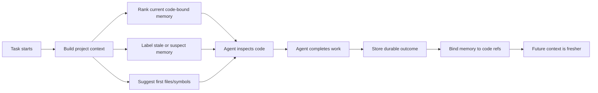

# Memory Autopilot 1.1.5 Design

Branch: `codex/1.1.5-memory-autopilot`
Date: 2026-07-02
Status: approved for autonomous implementation

## Summary

1.1.5 turns the existing CodeGraph Memory MVP into a product-facing Memory Autopilot layer. The user experience should feel like Claude Code: the user does not need to memorize commands, refresh indexes, decide which memory plane matters, or understand CodeGraph internals. Memorix should quietly build a compact, reliable project brief that agents can use at the start of real coding work.

This release does not try to become a full language server, a complete code intelligence product, or a replacement for external CodeGraph/Understand tools. It makes Memorix better at deciding when memory is useful, packaging memory with current code facts, warning when memory is stale, and giving agents a small set of high-value next reads.

## Product Promise

Memorix should not dump more text into the context window. It should decide what is worth carrying forward.

For coding agents, the valuable unit is no longer "old chat text." The valuable unit is a checked project brief:

- current code facts,
- code-bound memory,
- stale-memory warnings,
- likely first files to inspect,
- verification hints,
- and a small agent instruction block that says how to use the packet.

The black-box user-facing promise is:

> Start a coding task. Memorix gives the agent the right project map, keeps stale memory labeled, and avoids making the user operate the memory system manually.

## Existing Baseline

The 1.1.3/1.1.4 line already includes:

- SQLite-backed CodeGraph Memory tables for files, symbols, import edges, and observation-to-code references.
- CodeGraph Lite indexing for JavaScript and TypeScript projects.
- `memorix context`, `memorix explain`, and `memorix codegraph ...` CLI entry points.
- MCP tools: `memorix_project_context`, `memorix_context_pack`, and `memorix_codegraph_status`.
- Auto-refresh when project context is missing or stale.
- Agent setup rules that mention project context and CodeGraph Memory.

1.1.5 should preserve these surfaces while improving the default result quality and safety.

## Goals

### P1: Spec and Release Spine

Create an explicit 1.1.5 spec and plan so the implementation is testable and releaseable. Keep the work scoped to Memory Autopilot, context quality, and security polish.

### P2: Safety Gate Polish

Add regression coverage for agent tool allowlisting and fix true user-input regex risks. Static scanners should see that inactive tools cannot be executed, and user search input should be treated as literal text unless a safe parser exists.

### P3: Context Pack Quality

Improve context packs so they do not only return code-bound memories. Relevant unbound memories should appear in a clearly labeled low-trust section when useful, while stale/suspect code-bound memories stay out of the reliable section.

### P4: Autopilot Brief Format

Change project context output from "raw summary" into an agent-ready brief with clear sections:

- Start here
- Reliable memory
- Verify before trusting
- Suggested verification
- How to use this

### P5: Freshness and Ranking Policy

Make the ranking policy explicit in code and docs:

- current code-bound memory beats unbound memory,
- stale/suspect memory is a warning, not a source of truth,
- small suggested reads beat large context dumps,
- generated/vendor paths should stay filtered.

### P6: Internal Self-Loop Rules

Update generated agent rules so agents learn the loop:

1. ask for project context when it helps,
2. inspect the suggested files,
3. store only durable decisions/fixes/gotchas,
4. bind useful memories to code where possible,
5. resolve stale or completed memories.

### P7: User-Facing Black-Box UX

Update docs and CLI wording so users see "Memory Autopilot" as the default. Advanced CodeGraph commands remain available, but the recommended path is `memorix context` or the `memorix_project_context` MCP tool.

### P8: Dogfood and MCP Smoke

Run targeted unit tests, CLI smoke, package build, and MCP/tool-profile checks. Smoke should exercise a real project context call after build.

### P9: Release 1.1.5

Bump package versions, update changelog/docs, run final verification, push the branch, open/merge the PR, publish npm, and create the GitHub release if all checks pass.

## User Experience

The user should be able to say:

> Continue this project. Use memory if useful.

The agent should not ask the user which Memorix command to run. It should call the default project context tool, read the compact brief, then inspect the suggested files before trusting old memory.

The CLI equivalent should be simple:

```bash
memorix context --task "continue auth bug"
```

Advanced commands still exist:

```bash
memorix codegraph refresh
memorix codegraph status --json
memorix codegraph context-pack --task "continue auth bug"
```

But they are no longer the main story.

## Internal Loop

Memory Autopilot is a loop, not a one-time retrieval API:



The loop should be best-effort. If CodeGraph Lite cannot see a language yet, Memorix still provides text memory, but labels the limitation clearly.

## Architecture

The existing `src/codegraph/` subsystem remains the owner of code-memory behavior.

- `auto-context.ts` owns the default project brief and refresh policy.
- `context-pack.ts` owns task-specific memory/code packaging.
- `project-context.ts` owns summary/explain data from the store.
- `binder.ts` links observations to files/symbols.
- `store.ts` owns SQLite persistence.

1.1.5 should add small policy helpers rather than broad rewrites.

## Data Model

No schema migration is required for this release. The existing observation-to-code references and code facts are enough to improve pack quality.

Unbound memories are not new rows. They are existing observations that:

- match the task,
- are active,
- have no current code reference,
- and are useful enough to include with lower trust.

## Ranking Rules

1. Current code-bound memory is reliable.
2. Stale or suspect code-bound memory becomes a warning.
3. Relevant unbound memory is useful but lower trust.
4. Suggested reads come from current refs and useful code facts first.
5. Generated, dependency, vendor, and build output paths are filtered.
6. Context packs stay compact even when the memory database is noisy.

## Safety Rules

- Agent tool execution must only resolve tools available in the current turn context.
- User search input must not become an unsafe regular expression.
- Docker runtime remains non-root.
- Empty catches and sync file reads are not treated as blanket release blockers for a local CLI, but security-relevant cases should be fixed when touched.

## Non-Goals

- Full multi-language semantic CodeGraph.
- Replacing external CodeGraph/Understand tools.
- Long-term cloud sync changes.
- New paid service dependencies.
- Large storage migration.
- Making every old memory automatically trustworthy.

## Acceptance Criteria

- `memorix context --task ...` prints an autopilot-style brief.
- `memorix_project_context` returns the same improved brief through MCP.
- Context packs include reliable current memories, lower-trust unbound memories, stale warnings, suggested reads, and verification hints.
- Inactive agent tools cannot be executed, with a regression test.
- Literal user search input cannot crash or create unsafe regex behavior.
- Agent setup rules describe the internal self-loop in plain language.
- Package build, targeted tests, CLI smoke, and MCP/tool-profile smoke pass.
- Changelog and version metadata are ready for 1.1.5 publication.
